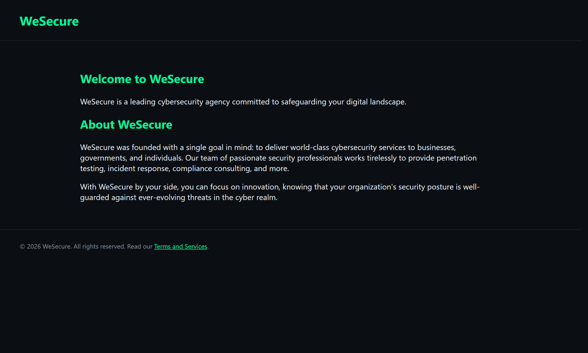
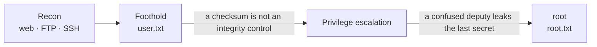
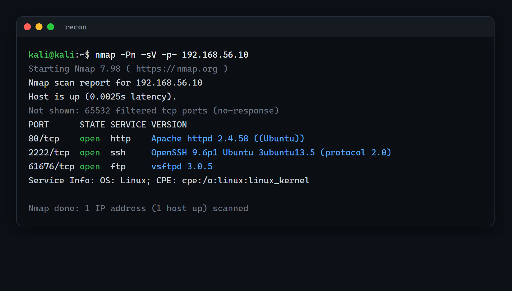

# WeSecure

A self-authored Linux boot-to-root machine, built as reproducible infrastructure. It presents a multi-stage attack chain in which each step turns one reasonable-looking control against the next, and it ships with a full technical writeup and a Packer/Ansible build that reconstructs the machine from source.



**Difficulty:** Medium · **Flags:** user + root · **Format:** OVA (VMware / VirtualBox)

**[Download the OVA](https://drive.google.com/file/d/1HtahWLvwFsDsmQE840_BPT0CtHN5nzc9/view?usp=sharing)** · **[Writeup](writeup/WeSecure-walkthrough.md)** (spoilers) · **[Full attack chain](writeup/attack-chain.md)** (spoilers)

## What this project demonstrates

- **Challenge and range design.** The box is authored, not solved: a self-contained environment with an intended, tested exploitation path and no known shortcuts.
- **Reproducible security infrastructure.** Packer builds the base image and Ansible introduces each vulnerability as a discrete role, so the whole machine rebuilds from code.
- **Multi-stage exploitation reasoning.** A chain from anonymous recon to root where each primitive defeats a specific control to unlock the next.
- **Trust-boundary and integrity thinking.** The escalation turns on a control that checks the wrong property, and on privileges that compose into an exposure neither owner intended.
- **Clear technical communication.** A reproducible, step-by-step writeup with a defensive takeaway for every finding.

## About

WeSecure is themed around a fictional security firm. It rewards methodical enumeration and the chaining of small, realistic misconfigurations over any single exploit: recon to a foothold, the user flag, then a privilege-escalation chain to root. The design question is deliberately narrow: what happens when every control in a stack is individually reasonable but collectively defeatable?

The same reasoning, composing primitives so each defeats a specific control to reach the next, is how agentic and LLM tool pipelines tend to fail. That parallel is part of why I built it.

## Design notes (defensive takeaways)

Two ideas anchor the escalation. The concrete exploitation lives in the writeup; the principles worth keeping are:

- **A checksum is not an integrity control.** A CRC detects accidental corruption, not a deliberate forgery by an adversary who can recompute it. Integrity that has to survive an attacker needs a keyed signature such as HMAC or code signing.
- **A confused deputy leaks the last secret.** A value that is safe under its own permissions becomes reachable when a separate, more-privileged service can be induced to read it on the requester's behalf. Isolated privileges still compose into exposure.

## Attack chain

At a high level the box moves through four phases, each defeating one control to reach the next. The two anchor principles above are the privilege-escalation edges. This view is intentionally abstract; the full step-by-step chain, with the specific services and misconfigurations, is in [the attack-chain diagram](writeup/attack-chain.md) (spoilers).



## Attack surface



## Machine details

| | |
|---|---|
| Base OS | Ubuntu 24.04.1 LTS, kernel 6.8.0-51, x86_64 |
| Format | OVA (VMware and VirtualBox) |
| Networking | DHCP |
| Resources | 2 GB RAM, 2 vCPU |
| Size | 1.95 GiB |
| Flags | `user.txt`, `root.txt` |
| Services | HTTP 80, SSH 2222, FTP 61676 (anonymous) |

## Download

`WeSecure.ova` (~1.95 GiB) is hosted on Google Drive; it is too large to keep in this repository.

**[Download WeSecure.ova (Google Drive)](https://drive.google.com/file/d/1HtahWLvwFsDsmQE840_BPT0CtHN5nzc9/view?usp=sharing)**

Verify the download before importing:

```
SHA256  556cab150d0bb19e6187a55f0684b170f3b8e31dae375fc2a9477a5dea44857c  WeSecure.ova
```

```bash
sha256sum WeSecure.ova                    # Linux, macOS
CertUtil -hashfile WeSecure.ova SHA256    # Windows
```

## Setup

1. Download `WeSecure.ova` and verify the checksum above.
2. Import into VMware Workstation/Player or VirtualBox.
3. Put the adapter on a network with DHCP (NAT, or a host-only network that runs a DHCP service).
4. Power on and treat the console as a black box; do not log in there.
5. Find the machine's IP from your attacking host with `netdiscover` or `arp-scan`.
6. Add the web vhost to your hosts file (see below), then begin.

The site is served on the `wesecure.vh` virtual host; add `<target_ip> wesecure.vh` to `/etc/hosts`. FTP is active-mode only, so use the `ftp` client rather than passive-only tools such as curl or a browser.

## Tested on

| Hypervisor | Version | Result |
|---|---|---|
| VMware Workstation (Windows) | 17.5.2 | Imports, boots via DHCP, solved end to end |
| VirtualBox | recent releases | Standard OVA; not independently retested |

Exported with `ovftool` 4.6.2 (compressed, no install media attached).

## Build

The machine is defined as code in [`build/`](build/): Packer builds a clean Ubuntu 24.04 image, Ansible introduces each vulnerability as a role mapped to one stage of the chain, and the result is exported as an OVA. A `Vagrantfile` gives a fast local loop. Details in [`build/README.md`](build/README.md).

Defining the box as code, rather than shipping only an opaque image, keeps it repeatable, version-controlled, and easy to vary. Those are the same properties an automated security-testing environment needs.

```bash
cp build/ansible/secrets.example.yml build/ansible/secrets.yml   # set passwords and flags

# provision a clean Ubuntu 24.04 host directly:
ansible-playbook build/ansible/site.yml -i '<host>,' -e @build/ansible/secrets.yml

# or build the full image from ISO:
cd build/packer && packer init . && packer build -var-file=build.pkrvars.hcl.example .
```

The playbook has been run against a clean Ubuntu 24.04 and the resulting machine solved end to end. The build is the source of truth for the box.

## Writeup

The full walkthrough is in [`writeup/WeSecure-walkthrough.md`](writeup/WeSecure-walkthrough.md). Credentials recovered along the way are shown; the flag values are not. It contains spoilers, so read it after your own attempt.

## Feedback

Found an unintended route or a broken step? Open an issue.

Mahdi Alhakim, security engineering and offensive security. [github.com/mahdi-al-hakim](https://github.com/mahdi-al-hakim)

## License

Build automation, documentation, and the writeup are released under the [MIT License](LICENSE). Bundled third-party software retains its own licensing.
