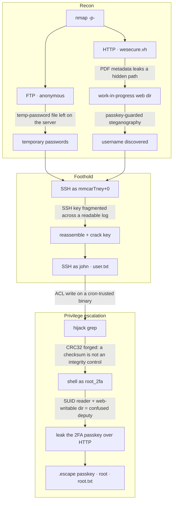

# WeSecure: Attack chain

> Full spoilers. This maps the intended path end to end. Read it after your own attempt, or alongside the [walkthrough](WeSecure-walkthrough.md).

Each edge is the control or oversight that turns one step into the next. The two labelled edges in privilege escalation are the box's anchor ideas: a checksum is not an integrity control, and a confused deputy leaks the last secret.

